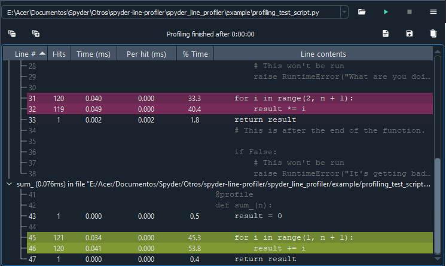

# Spyder line profiler plugin

## Project details


[](https://www.anaconda.com/download/)
[](https://www.anaconda.com/download/)
[](https://pypi.python.org/pypi/spyder-line-profiler)
[](https://gitter.im/spyder-ide/public)
[](#backers)
[](#sponsors)

## Build status

[](https://github.com/spyder-ide/spyder-line-profiler/actions?query=workflow%3A%22Windows+tests%22)
[](https://github.com/spyder-ide/spyder-line-profiler/actions?query=workflow%3A%22Linux+tests%22)
[](https://github.com/spyder-ide/spyder-line-profiler/actions?query=workflow%3A%22Macos+tests%22)
[](https://codecov.io/gh/spyder-ide/spyder-line-profiler/branch/master)

## Description

This is a plugin to run the Python
[line_profiler](https://pypi.python.org/pypi/line_profiler)
from within the Python IDE [Spyder](https://github.com/spyder-ide/spyder).

The code is an adaptation of the profiler plugin integrated in Spyder.

## Installation

To install this plugin, you can use either ``pip`` or ``conda`` package
managers, as follows:

Using conda (the recommended way!):

```
conda install spyder-line-profiler -c conda-forge
```

Using pip:

```
pip install spyder-line-profiler
```

## Usage

Add a `@profile` decorator to the functions that you wish to profile then
Shift+F10 (line profiler default) to run the profiler on the current script,
or go to `Run > Run line profiler`.

The results will be shown in a dockwidget, grouped by function. Lines with a
stronger color take more time to run.

## Screenshot



## Contributing

Everyone is welcome to contribute!

## Sponsors

Spyder and its subprojects are funded thanks to the generous support of

[](https://www.quansight.com/)[](https://numfocus.org/)

and the donations we have received from our users around the world through [Open Collective](https://opencollective.com/spyder/):

[](https://opencollective.com/spyder#support)
