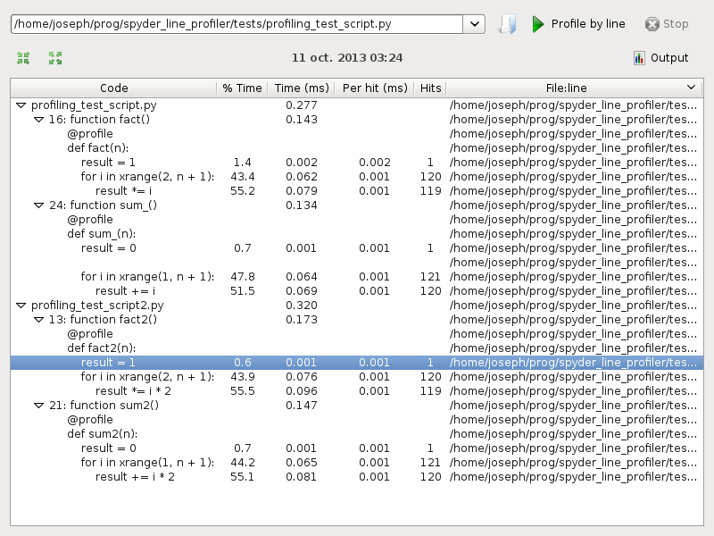

spyder_line_profiler
====================

Description
-----------

This is a plugin to run the python `line profiler <https://github.com/rkern/line_profiler>`_ and `memory_profiler <https://pypi.python.org/pypi/memory_profiler>`_ from within the `spyder <https://code.google.com/p/spyderlib/>`_ editor.

The code is an adaptation of the profiler plugin integrated in `spyder <https://code.google.com/p/spyderlib/>`_.

Install instructions
--------------------

Put the files ``p_lineprofiler.py``, ``p_memoryprofiler.py``, ``widgets/lineprofilergui.py``, and ``widgets/memoryprofilergui.py`` in the directory ``spyderplugins/`` from the spyder installation.

For example on Linux this should be ``/usr/lib/python2.7/dist-packages/spyderplugins/`` or equivalent.

**Line profiler requirements:** The line_profiler module and the kernprof script have to be installed and accessible on the system. See the `official line_profiler website <https://github.com/rkern/line_profiler>`_ for instructions.

**Memory profiler requirements:** The memory_profiler module has to be installed. See the `official memory_profiler website <https://pypi.python.org/pypi/memory_profiler>`_ for instructions.

Usage
-----

Add a ``@profile`` decorator to the functions that you wish to profile then press Shift+F10 (line profiler default) or Ctrl+Shift+F10 (memory profiler default) to run the profiler on the current script, or go to ``Run > Profile line by line`` or ``Run > Profile memory line by line``.

The results will be shown in a dockwidget, grouped by function. Lines with a stronger color take more time to run (line profiler) or have the largest increments in memory usage (memory profiler).

Screenshot
----------

Line profiler:

