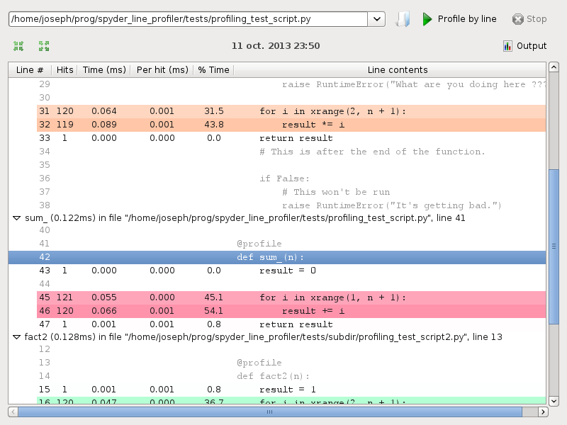

spyder_line_profiler
===========================

Project information 
-------------------

.. image:: https://img.shields.io/pypi/l/spyder-line-profiler.svg
   :target: https://github.com/spyder-ide/spyder-line-profiler/blob/master/LICENSE.txt
   
.. image:: https://img.shields.io/pypi/v/spyder-line-profiler.svg
   :target: https://pypi.python.org/pypi/spyder-line-profiler

.. image:: https://badges.gitter.im/spyder-ide/spyder.svg
   :target: https://gitter.im/spyder-ide/public

Build information
-----------------

.. image:: https://travis-ci.org/spyder-ide/spyder-line-profiler.svg?branch=master
   :target: https://travis-ci.org/spyder-ide/spyder-line-profiler

.. image:: https://ci.appveyor.com/api/projects/status/u8m20qgel4j155pn/branch/master?svg=true
   :target: https://ci.appveyor.com/project/spyder-ide/spyder-line-profiler

.. image:: https://circleci.com/gh/spyder-ide/spyder-line-profiler/tree/master.svg?style=shield
   :target: https://circleci.com/gh/spyder-ide/spyder-line-profiler/tree/master

.. image:: https://coveralls.io/repos/github/spyder-ide/spyder-line-profiler/badge.svg?branch=master
   :target: https://coveralls.io/github/spyder-ide/spyder-line-profiler?branch=master

.. image:: https://www.quantifiedcode.com/api/v1/project/54e5f210a2dd4d979438fd8574650822/badge.svg
   :target: https://www.quantifiedcode.com/api/project/54e5f210a2dd4d979438fd8574650822

.. image:: https://scrutinizer-ci.com/g/spyder-ide/spyder-line-profiler/badges/quality-score.png?b=master
   :target: https://scrutinizer-ci.com/g/spyder-ide/spyder-line-profiler/?branch=master)

Description
-----------

This is a plugin to run the python `line profiler <https://github.com/rkern/line_profiler>`_ from within the python IDE `spyder <https://github.com/spyder-ide/spyder>`_.

The code is an adaptation of the profiler plugin integrated in spyder.

Install instructions
--------------------

See https://github.com/spyder-ide/spyder/wiki/User-plugins but in
short, the following command installs the development version of the
line-profiler plugin:
 
::

  pip install git+git://github.com/spyder-ide/spyder-line-profiler.git
 
The plugin is not yet included in PyPI.

You need to also install `Spyder <https://github.com/spyder-ide/spyder>`_ (version 3.0 or higher) and the `line profiler <https://github.com/rkern/line_profiler>`_ .

Usage
-----

Add a ``@profile`` decorator to the functions that you wish to profile then press Shift+F10 (line profiler default) to run the profiler on the current script, or go to ``Run > Profile line by line``.

The results will be shown in a dockwidget, grouped by function. Lines with a stronger color take more time to run.

Screenshot
----------
Line profiler:

